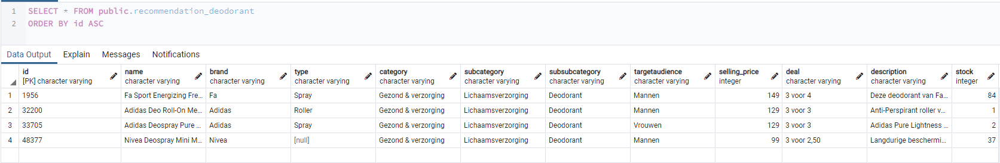
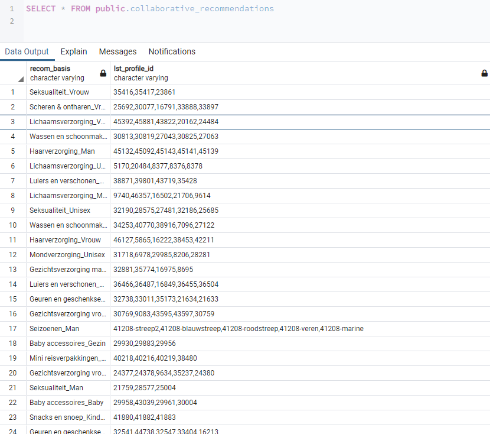

# SP_Opdracht_3
Business rules voor Recommendation Engine
### create_content_recommendation_table
De functie kan verschillende tabellen maken en bestaande tabellen legen.
Doordat de functie een aantal inputs heeft is hij overal op toepasbaar
Je kan op category, op prijs op gender enzv een recommendation maken en dan op prijs of op aantal besachikbaar ook nog sorteren.

###

 
